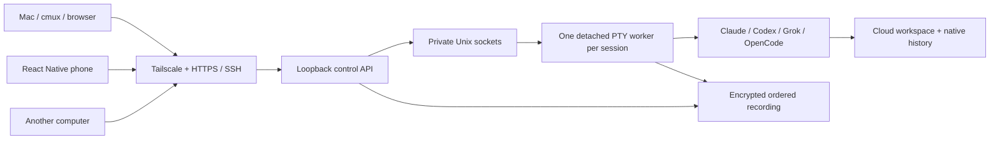

# Session ownership and protocol

This page describes the implemented **single-tenant runner**. The managed service now requires a separate runner and confidential execution boundary per user. Global control-plane accounts must never become runner data-access roles. See [managed tenants](multi-tenant.md) for the accepted architecture, hardware limitation, development backend, and confidential release gates.

## Execution model

The user chose permanent cloud execution on 2026-10-04. The laptop and phone are clients. Returning to the laptop means reconnecting to the existing cloud process, with no provider `new`, `fork`, or `resume` call. This avoids trying to transfer live processes between macOS and Linux.

The native process lives under its worker, not the HTTP server. An API crash leaves workers alive. Each worker owns its recording and input receipt map. The single HTTP listener binds only to `127.0.0.1`; HTTPS and private device networking belong to Tailscale Serve. A laptop can use ordinary SSH from a cmux pane to run `infinite attach SESSION_ID` on the host. No cmux internals are required.

## State and failure behavior

`starting → running → exited`. An unreachable worker is reported as `unavailable`, never “completed.” Recording failure sets `recording-error` and attempts to suspend the native process with SIGSTOP. This favors preserving the record over continuing silently without one. Operator intervention is required if storage fills.

Browser/network loss does not change worker state. API restart discovers existing workers through their private sockets and existing encrypted metadata. Host power loss, a native crash, or loss of the worker process is a different failure: this version retains the recording but does not recreate or resume the process. There is no second cloud host or high availability claim.

Terminal-native input can include arbitrary keyboard sequences over owner-only SSH/local IPC. Web/mobile text input rejects escape/control injection. Multiline paste is allowed only after the terminal application advertises bracketed-paste support. Explicit Enter/Escape/arrow/interrupt controls handle provider menus. None of these controls infer tool approval.

## Delivery contract

Creation uses a client UUID as the logical session ID. The stored request fingerprint makes an identical retry return the existing session; a conflicting reuse fails. Creation does not automatically retry spawning after an ambiguous failure.

Input carries a client-generated `requestId`. The worker durably appends intent, writes to the PTY, then durably appends the result. Concurrent identical retries return one receipt. If the write may have happened but the result was not recorded, that ID remains uncertain. It must not be silently reissued under another ID. Exactly-once execution of a provider's tool is not guaranteed by exactly-once terminal input.

Each event has `seq`, `at`, `type`, and `data`. The encrypted journal uses 256-record segments. `GET /api/sessions/:id/events?after=N&limit=200` returns `{events,cursor,more}`. Clients advance only to a received cursor and page until `more=false`. Events are retained after native process exit. There is no automatic record deletion or retention quota yet.

## API capabilities

All API routes except login require a bearer key or same-origin HttpOnly cookie. The web UI and native client use this same API; automation has the same primitives.

`GET /api/me` includes a `security` object with `mode`, `tenancy`, `isolation`, `tenantId`, `contextScope`, `operatorConfidential`, `attestation`, and `dataPolicy`. These are development capability descriptions, not remote attestation evidence. The current implementation always reports `operatorConfidential: false`. Direct single-tenant use needs no VM isolation. Multi-tenant development requires an external VM boundary per runner. Different roles on one API see the same tenant's collection.

| Action | Endpoint | Role |
| --- | --- | --- |
| Browser login | `POST /api/login` | Valid key, matching Origin |
| Device capabilities | `GET /api/me` | Any paired role |
| List / inspect sessions | `GET /api/sessions`, `GET /api/sessions/:id` | Any |
| Create session | `POST /api/sessions` | Owner |
| Replay logs | `GET /api/sessions/:id/events`, optionally filtered with `?types=` | Any |
| Answer an on-screen dialog | `POST /api/sessions/:id/answer` | Owner, controller |
| Register / remove a push token | `POST /api/devices/push`, `DELETE /api/devices/push` | Any |
| Send text | `POST /api/sessions/:id/input` | Owner, controller |
| Send control key | `POST /api/sessions/:id/key` | Owner, controller |
| Resize / terminate | `POST /api/sessions/:id/resize`, `/stop` | Owner |
| Read project context | `GET /api/projects/:id/context` | Any |
| Replace context with version check | `PUT /api/projects/:id/context` | Owner |

Session IDs and project IDs are validated. Clients cannot supply a filesystem path, executable, or arbitrary argument vector at session creation. These come from private host configuration. The prompt is passed as a process argument to the native CLI, never through a shell; active-host process inspection can see it.

The maximum concurrency defaults to 24; it is a count limit, not CPU, memory, spend, or per-provider quota enforcement. Resource limits and isolated worktrees belong to commissioning. Do not run multiple editors against one configured checkout until those directories are separated.

## Signals and attention

The worker records evidence about what an agent is doing as journaled events with `type = "signal"`, a `kind`, and a `source` of `hook`, `osc`, `screen` or `host`. Hook signals come from the Claude Code and Codex hooks Infinite injects for its own process; Codex hooks are off by default until the Codex spike confirms them. OSC signals come only from Codex's OSC 9 terminal notifications. Screen signals come from dialog detection on the rendered terminal. Host signals come from the worker's own answers and prompt bookkeeping, such as an answer and the prompt close it causes. Exit and recording errors are lifecycle events, not signals.

Every journaled `prompt-open` is closed exactly once. When a turn-end, or a turn or tool hook for a hook-only prompt, would drop the open prompt, the worker journals `prompt-closed` with reason `resolved` first. A prompt detected on screen stays open across turn and tool hooks; only its block leaving the screen or an answer closes it. When a hook opened the prompt and the screen block arrives later, the worker journals a `prompt-merged` notice with the block's own title and detail for the timeline.

Each session reports one attention state: `working`, `needs-you`, `turn-finished`, `idle`, `exited`, `unavailable` or `recording-error`. The state is derived from the signals; the sources stay labeled so a client can tell a hook from a screen guess.

A hook prompt is merged into the on-screen dialog only when it correlates line-for-line with it. Otherwise it is journaled as a `prompt-mismatch` notice and the on-screen dialog stands. The merged prompt always shows the on-screen detail.

`POST /api/sessions/:id/answer` answers a dialog the terminal already shows. The client sends only the prompt id. The worker checks that it is still the open prompt and that the hash it stored for that prompt matches the dialog on the live screen. The worker sends keystrokes that navigate to the chosen option and presses Enter only after re-checking that the marker is on that option. A post-check reports `closed`, `still-open` or `changed`. Hooks never decide anything: the worker answers hooks with an empty `204`, so the laptop's dialog always appears and can still be answered there.

`POST /api/sessions/:id/input` refuses text while the open prompt's dialog is on screen, with `409 { error: "prompt-open", attention }`, because text and Enter would select the dialog's highlighted option. Nothing is typed or journaled. A request with `force: true` is delivered anyway; only terminal surfaces, where the person sees the dialog, send it.

The `Notifier` in the API process polls session attention and sends a push message through the Expo push service on a transition into a configured state. Push only happens while the API runs.

## Provider boundary

All four providers initially use their native interactive CLI in a PTY. This gives a common terminal transport and retains normal native behavior without inventing a cross-provider session format. Local `--help` confirmed launch/resume flags; authenticated turns on the new host are still unverified.

Future structured adapters can normalize user/assistant messages, approvals, tool calls, and model usage while preserving native IDs. Codex exposes thread/turn lifecycle methods; Grok and OpenCode expose ACP/server interfaces. Each provider must be tested independently; an adapter mock is insufficient. [Codex app server](https://learn.chatgpt.com/docs/app-server), [Grok scripting and ACP](https://docs.x.ai/build/cli/headless-scripting), [OpenCode server](https://opencode.ai/docs/server/).

Claude Remote Control keeps execution on the originating machine, so it cannot itself keep a laptop-hosted agent working after laptop shutdown. [Claude documentation](https://code.claude.com/docs/en/remote-control).

Herdr supplied the useful client/runtime separation and native-terminal reference. Nuphos supplied a reference for remote runtimes and mobile conversations. No code was copied from either. Their advertised multi-machine features are not evidence that an arbitrary running Mac process can migrate intact to Linux. [Herdr machines](https://herdr.dev/docs/connecting-machines/), [Nuphos](https://github.com/nuphos/nuphos).
