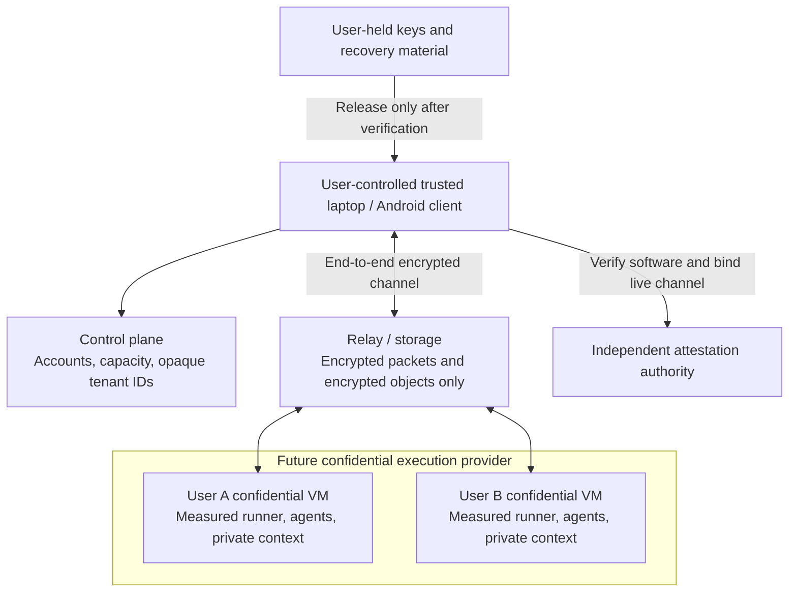

# Managed tenants with operator confidentiality

Status: accepted product direction, development foundation implemented. Confidential execution, client attestation, key release, encrypted relay, and live VM provisioning are not implemented. The development server now runs the owner-controlled single-tenant pilot; no multi-tenant VMs have been provisioned. See [single-tenant commissioning](../deploy/ubuntu/commissioning.md).

## Decisions

Keep two top-level deployment choices:

| Mode | Execution and context | Operator trust |
| --- | --- | --- |
| Single tenant | Run directly on the owner's host; one shared user environment; no per-user VM boundary needed | The owner trusts the host. Native providers work today. |
| Multi-tenant | Separate full execution environment and complete context bucket per user, including the owner | Private service target excludes operator access; ordinary VM development cannot make that claim. |

`single-tenant` is the default runner configuration (`personal` is accepted as a legacy alias). `tenant-development` is the synthetic-only backend used to develop multi-tenant VM boundaries. `confidential` is the future managed private backend and currently refuses initialization. These deployment choices do not remove API authentication or encryption from single-tenant use.

In multi-tenant mode, each user, including the service owner, gets a separate execution environment and context bucket. A bucket includes source files, sessions, recordings, memories, indexes, browser profiles, caches, native agent homes, credentials, temporary files, and backups. The service must eventually keep these contents confidential from its own operator, as well as from other tenants. A role inside one Infinite instance is not a tenant boundary.

Execution stays on the server when a laptop disconnects. Clients attach to that same process. The user selected managed confidential VMs rather than user-operated cloud accounts. We can develop the provisioning and tenant boundaries on ordinary VMs, but they cannot receive private workloads under the required confidentiality promise.

The development host runs the single-tenant pilot and can support control-plane work for the managed service. It has 16 logical CPUs, approximately 62 GiB usable RAM, and mirrored NVMe storage, but lacks the confidential VM features needed for operator-private execution. Hardware identity and verification receipts are recorded privately, outside this repository. Ordinary memory encryption does not supply per-guest protection from the hypervisor, and Proxmox cannot add missing hardware capabilities.

## Two separate planes

This diagram is the target, not the current transport. Today the browser/mobile clients send plaintext application messages over their configured HTTP/TLS connection to a single runner; ordinary TLS termination must not be moved into an operator-controlled relay and described as end-to-end encryption.

The operator plane can know account identifiers, tenant UUIDs, quota allocations, lifecycle status, billing, ciphertext sizes, network endpoints, and timing. It must never receive prompts, session titles, output, repository paths/content, provider keys, plaintext logs, backup keys, or recovery material. Avoid crash reports, analytics, push notification bodies, and support bundles containing these contents. Resource metadata itself is not anonymous.

Run one Infinite installation inside each tenant VM. Reuse the existing per-instance roles only for that tenant's own laptop, controller, and viewer. Do not place multiple tenants in today's API and try to distinguish them with different device keys. Do not let a global administrator mint a credential that can read or steer a tenant runner.

## What makes the operator unable to decrypt

The future confidentiality boundary requires all of the following together:

1. **Hardware-backed confidential execution.** Use a supported, patched TEE platform with a verifiable hardware/attestation chain. An encrypted disk, encrypted RAM marketing label, VM isolation, or a `confidential: true` flag is insufficient.
2. **Measured, immutable runner software.** Pin the exact approved workload and boot environment. Disable operator SSH, serial shells, cloud Run Command/guest extension paths, debugging, plaintext output forwarding, and unmeasured startup overrides. Pin the agent runtimes and dependencies; operator-controlled automatic updates must not change trusted code after attestation.
3. **User-controlled release policy.** The user generates and holds recovery/root keys. The operator cannot alter the trusted verifier, approved image policy, or KMS release policy. A KMS key in an account fully controlled by the operator does not establish this separation merely because the key is non-exportable.
4. **Attestation tied to this connection and tenant.** Before sending any key, credential, or private request, the trusted client verifies the signed evidence, authority, audience, fresh challenge, expiry, hardware/debug/boot state, software digest, effective arguments/environment, and tenant/owner identity. Bind the proof to the live encrypted channel or a key generated inside the measured runtime. A valid quote copied from another genuine VM must not authenticate an attacker-controlled endpoint. Google documents TLS exporter binding for this reason. [Channel binding](https://docs.cloud.google.com/confidential-computing/confidential-space/docs/connect-external-resources).
5. **Keys and plaintext remain inside the boundary.** Workspace encryption and backup encryption happen inside the tenant's trusted runtime; external storage receives ciphertext. Protect every writable location, including native histories, browser caches, temp files, swap, and crash dumps. The existing journal encryption covers only Infinite's own records.
6. **No operator recovery bypass.** Lost recovery keys can mean lost data. Support can stop, restart, meter, and delete infrastructure; it cannot decrypt a backup or reset access to private context. A user can choose to export particular material for support through an explicit client action.

Google Confidential Space is a useful reference because its model explicitly separates resource owners, workload authors, and an untrusted workload operator. Ordinary Confidential VMs still require care around guest administrator access and mutable software. Neither product name alone proves Infinite's boundary. [Confidential Space security model](https://docs.cloud.google.com/docs/security/confidential-space).

A browser app freshly served by the operator can be replaced with JavaScript that steals keys or plaintext. Private sessions therefore require a trusted installed client or a locally verified web bundle served by that client. Native code signing alone also gives the publisher power to ship a malicious update. Users need an independently inspectable build, pinned approved release, and an explicit trust/update decision. No blanket authorization of every future operator-signed build.

## Unattended work and recovery

For the first confidential execution milestone, the user's trusted client unlocks a newly attested runner. The key stays in the protected running environment, so the laptop and phone can both go offline without stopping work. A runner reboot or replacement starts locked and waits for the user to verify and unlock it again. This preserves laptop-outage continuity without inventing an operator-held recovery key.

Automatic unlock after a server restart is a later feature. It needs a continuously available key-release authority outside the operator's control, or an independently attested release service whose policy and upgrade authority the operator cannot change unilaterally. Moving an ordinary key service into another operator-owned VM does not solve the problem.

Encrypted backups need authenticated tenant/volume identities, versioned manifests, and recovery testing. Confidentiality does not prevent the operator deleting, withholding, replaying, or forking encrypted state. Detect rollback through independently anchored checkpoints and fence concurrent restored runners; do not claim the existing journal solves this. Revoking future key release does not retract a key already present in a running guest.

## Development now on Proxmox

The current runnable foundation is deliberately smaller than the target:

- Direct `single-tenant` execution still runs native agents without a tenant UUID, Proxmox, or attestation. It imposes no new context isolation on that one user's existing session collection.
- `infinite plan-fleet FILE` emits a secret-free plan with a distinct KVM VM, disk owner, network identity, quotas, and runner deployment mode per tenant. It checks identity collisions and resource budgets, rejects secret-bearing unknown fields, and refuses private data on the current backend. It does not call Proxmox or install firewall rules.
- `tenant-development` initialization creates a separate runner with only the synthetic rehearsal provider. Its `/api/me` response explicitly reports `operatorConfidential: false`, no attestation, and a synthetic-only data policy.
- Requesting `confidential` execution fails before initialization creates configuration or keys. No environment variable or configuration boolean can turn this development implementation into an attestation provider.
- Two independent runner instances are integration-tested for cross-tenant key, session, context, recording, and steering rejection. These are application-boundary tests on the local machine, not proof of KVM, firewall, or hardware isolation.

The configuration guard is an operator development safeguard, not a cryptographic defense against someone modifying the program. It cannot recognize whether text pasted into a rehearsal is sensitive. Use synthetic content and disposable credentials only. Do not enroll friends into an operator-confidential private-data service on this hardware.

See [Proxmox development setup](../deploy/proxmox/README.md). Ordinary VM deployment must keep separate disks, keys, accounts, homes, networks, and backups, with no shared writable mounts. Enforce lateral traffic, anti-spoofing, and management-plane denial on the hypervisor; guest firewall rules and shared Tailscale machines alone are insufficient. Resource limits must be applied by the VM host, not just written in a JSON plan.

## Confidential backend selection

| Candidate | Why investigate | Work required before choosing |
| --- | --- | --- |
| Google Confidential Space | Hardened workload runtime designed to constrain an untrusted operator | Persistent encrypted workspace, CLI/browser/tool compatibility, user-controlled release, and attested client channel |
| Hardened AMD SEV-SNP / Intel TDX VM | General Linux environment closer to today's agent host | Independently verified boot/workload measurements, immutable software, removed operator guest access, firmware policy, storage and key release |
| AWS Nitro Enclaves | Explicit protection from parent-instance root/admin | Networking and durable storage adapters; not a normal Ubuntu server drop-in |

Confidential Space is designed around a single container workload without ordinary persistent storage. Nitro Enclaves likewise lack direct external networking and persistent storage. Both need a storage design that preserves the agents' working filesystem and recordings. Do not select them based only on an attestation demo that decrypts one string. [Confidential Space images](https://docs.cloud.google.com/confidential-computing/confidential-space/docs/confidential-space-images), [Nitro Enclaves concepts](https://docs.aws.amazon.com/enclaves/latest/user/nitro-enclave-concepts.html).

Keep the backend interface separate from the tenant contract: provision resource, obtain evidence, verify channel, unlock user volume, run sessions, lock/terminate, and export encrypted backup. Provisioning success and provider-reported capabilities are not evidence verification. No real confidential backend has been selected or commissioned yet.

## Acceptance before private tenants

The release gate must reject forged or replayed evidence, wrong tenant/owner, substituted channel keys, non-confidential hardware, debug mode, stale or revoked firmware/software, changed images, startup overrides, and unavailable verification services. There must be no downgrade to an ordinary VM. Validate with real platform evidence, not just fixture signatures.

Attempt access with operator cloud IAM, host root, guest command/console facilities, storage snapshots, captured relay traffic, telemetry, backups, altered update packages, and support workflows. The operator must not obtain user plaintext or tenant steering authority. Independently test cross-tenant IPv4/IPv6 access, host-management access, disk sharing, resource exhaustion, and restore/fork behavior.

Run real Claude/Codex/Grok/OpenCode turns and tools with isolated workspaces, then disconnect every user device while the approved operation continues. Confirm the same process after reconnection. Test a host restart separately and confirm the documented locked recovery state rather than silently creating a new session.

The remaining trusted parties include the user's device and selected software, hardware/firmware and attestation authorities, and model providers receiving prompts. A compromised agent or user-authorized dependency can leak data it can access. The operator can deny service, and traffic metadata can remain visible. Describe the guarantee against named threats; do not advertise total protection against every compromise.
