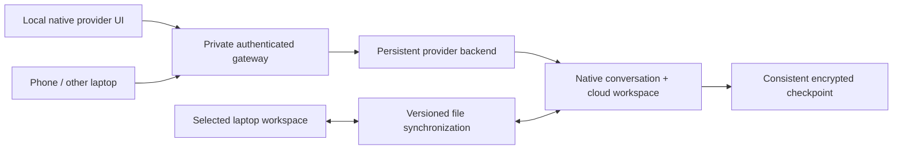

# Native interaction and session continuity

## Required experience

Typing, cursor movement, prompt editing, and navigation within already loaded history must not wait for the cloud. Fetching new cloud data, running tools, and receiving model responses still depend on the network and execution host. Closing the laptop must leave an agent available from a phone or another laptop. Reopening it must reconnect to the latest conversation and workspace without creating or forking a conversation. The native provider interface remains the default; Ctrl+E local drafting is an optional aid for terminal-streamed providers, not proof of native UI parity.

The current pilot runs provider terminals on the execution host and streams their output. That preserves live processes when a laptop disconnects. It does not make a remote terminal equivalent to a locally running interface. Measurements on 2026-10-05 found a direct Tailscale round trip of 1.183 seconds, while loopback API responses took 0.3–10.2 ms. Transport improvements remove application delays; they cannot remove the network round trip from remote echo.

## Herdr review

Reviewed [herdrdev/herdr at e35f3937b0efe40ec0dab675709c68e1d8e8c9e6](https://github.com/herdrdev/herdr/tree/e35f3937b0efe40ec0dab675709c68e1d8e8c9e6) on 2026-10-05, focusing on client/server transport, persistence, restoration, and provider session references. This was a source review, not a live migration test.

| Mechanism | What Herdr implements | Consequence for Infinite |
| --- | --- | --- |
| Background runtime | A server owns panes and processes independently of attached clients. | Keep execution independent of laptop, phone, and API lifetimes. |
| Multiple machines | Each machine owns separate sessions and processes; clients connect through SSH bridges. | A combined machine list does not move a local agent onto a cloud machine. |
| Structural snapshots | Layout, directories, pane identity, and native session references are persisted. | A terminal snapshot is not a portable provider conversation plus workspace. |
| Provider restore | Valid integration-reported IDs select provider-native resume commands. | Record native IDs explicitly; never infer one from the last transcript filename. |
| Live handoff | A replacement server can inherit live pane runtimes during supported updates. | Same-host runtime transfer does not establish macOS-to-Linux process migration. |

The [machine documentation](https://herdr.dev/docs/connecting-machines/) describes independent runtimes, cached disconnected views, and input disabled until fresh state arrives. The [session-state documentation](https://herdr.dev/docs/session-state/) separates live persistence, structural restore, optional screen history, native conversation resume, and update handoff.

The relevant source boundaries are [snapshot data](https://github.com/herdrdev/herdr/blob/e35f3937b0efe40ec0dab675709c68e1d8e8c9e6/src/persist/snapshot.rs), [snapshot writing and recovery](https://github.com/herdrdev/herdr/blob/e35f3937b0efe40ec0dab675709c68e1d8e8c9e6/src/persist/writer.rs), [restore](https://github.com/herdrdev/herdr/blob/e35f3937b0efe40ec0dab675709c68e1d8e8c9e6/src/persist/restore.rs), [provider resume plans](https://github.com/herdrdev/herdr/blob/e35f3937b0efe40ec0dab675709c68e1d8e8c9e6/src/agent_resume.rs), and the [SSH attachment bridge](https://github.com/herdrdev/herdr/blob/e35f3937b0efe40ec0dab675709c68e1d8e8c9e6/src/remote/attach.rs). No Herdr source has been copied into Infinite.

## Orca review

Reviewed [stablyai/orca at e2da3a1eb1962f31ad01f0e2172119d95ae10015](https://github.com/stablyai/orca/tree/e2da3a1eb1962f31ad01f0e2172119d95ae10015), package version 1.4.214, on 2026-10-05. This was a focused source and documentation review; Orca was not installed, run, benchmarked, or copied into Infinite.

Orca's full remote-server mode is a useful reference for this project: the execution host owns workspaces, provider credentials, processes, and session state; desktop and phone clients attach to it. Its SSH-worktree mode has a different ownership arrangement and should not be conflated with the full runtime. [Remote-server contract](https://www.onorca.dev/docs/remote-servers).

| Pattern in the reviewed source | Apply to Infinite |
| --- | --- |
| A durable session record holds execution location, workspace, pinned account home, provider-handle lineage, and a separate process lease. Process identity includes more than a PID. | Keep the Infinite conversation ID independent of the terminal, attachment, provider process, and recovery generation. A second client must not create a second execution owner. [Record contract](https://github.com/stablyai/orca/blob/e2da3a1eb1962f31ad01f0e2172119d95ae10015/src/shared/agent-session-record.ts). |
| Terminal restoration uses an authoritative rendered snapshot with an output sequence, then removes output already covered by that snapshot. Checkpoint work is serialized per session with bounded waiting. | Attach to the current screen first and load older recording history on demand. Bind the snapshot to the same sequence domain as its following events. One busy session must not block every other attachment. [Snapshot source](https://github.com/stablyai/orca/blob/e2da3a1eb1962f31ad01f0e2172119d95ae10015/src/main/daemon/daemon-pty-buffer-snapshots.ts), [delta reconciliation](https://github.com/stablyai/orca/blob/e2da3a1eb1962f31ad01f0e2172119d95ae10015/src/main/runtime/rpc/methods/terminal/terminal-stream-replay.ts), [checkpoint queue](https://github.com/stablyai/orca/blob/e2da3a1eb1962f31ad01f0e2172119d95ae10015/src/main/daemon/daemon-checkpoint-session-queue.ts). |
| Structured history has bounded pages, journal epochs, stable item identities and revisions, deletion records, and incremental subscriptions. | Give mobile a compact transcript, tool progress, and explicit approval/question cards over the same conversation. Preserve the native laptop CLI as its own attachment mode. Fetch a recent page before older history; do not rebuild the whole chat from ANSI on each reconnect. [Structured wire contract](https://github.com/stablyai/orca/blob/e2da3a1eb1962f31ad01f0e2172119d95ae10015/src/shared/agent-session-wire.ts). |
| Submissions are recorded before dispatch and reconciled against provider history after a crash. Repeated equal text is not sufficient proof of message identity. | Extend delivery evidence beyond a successful PTY write when structured adapters exist. Keep uncertain sends visible, and never submit them again automatically. [Submission reconciliation](https://github.com/stablyai/orca/blob/e2da3a1eb1962f31ad01f0e2172119d95ae10015/src/main/native-chat/agent-session-journal/journal-submission-reconciler.ts). |
| Viewing terminal geometry and claiming control are separate operations. Mobile writes reserve and commit an input claim. | Add explicit control ownership for concurrent laptop/phone steering and resizing. Watching must not steal input or resize another client's terminal. This device-control contract is separate from the execution-owner lease. [Viewport ownership](https://github.com/stablyai/orca/blob/e2da3a1eb1962f31ad01f0e2172119d95ae10015/src/main/runtime/rpc/methods/terminal/terminal-viewport-update.ts), [input delivery](https://github.com/stablyai/orca/blob/e2da3a1eb1962f31ad01f0e2172119d95ae10015/src/main/runtime/rpc/methods/terminal/terminal-input-delivery.ts). |
| Client and host negotiate capabilities; new stream operations require agreement, and absent status evidence remains unknown. | Extend Infinite's current `terminal.duplex` capability into versioned provider and session capabilities. An old phone or host must withhold unsupported actions without inventing an idle or completed state. [Compatibility contract](https://github.com/stablyai/orca/blob/e2da3a1eb1962f31ad01f0e2172119d95ae10015/docs/reference/remote-wire-compatibility.md). |
| Mobile E2EE v2 binds keys to the handshake, transport context, direction, session, and ordered frame counters. The execution runtime decrypts incoming requests. | Use authenticated encryption between clients and the trusted tenant runtime if a relay is added. For operator-confidential tenants, that endpoint must be bound to attestation. Transport encryption alone does not hide plaintext from the machine executing the agent. [E2EE v2 implementation](https://github.com/stablyai/orca/blob/e2da3a1eb1962f31ad01f0e2172119d95ae10015/src/main/runtime/rpc/mobile-e2ee-v2-desktop-session.ts). |

### Native CLI fidelity and documentation drift

Orca implements three launch routes: a terminal, a chat view backed by a terminal, and a structured chat backed by provider adapters. Its structured Claude path uses the Claude Agent SDK with the installed Claude executable; Codex uses an app server. These are useful references for Infinite's mobile adapters, but Orca's own chat interface does not establish that the provider's native terminal interface runs locally against a remote backend. Existing terminal sessions retain their transport; history adoption checks for conflicting ownership. [Launch routing](https://github.com/stablyai/orca/blob/e2da3a1eb1962f31ad01f0e2172119d95ae10015/src/renderer/src/lib/agent-launch-routing.ts), [Claude connection](https://github.com/stablyai/orca/blob/e2da3a1eb1962f31ad01f0e2172119d95ae10015/src/main/claude/claude-stream-json-connection.ts), [Codex launch](https://github.com/stablyai/orca/blob/e2da3a1eb1962f31ad01f0e2172119d95ae10015/src/main/codex/codex-structured-launch-resolution.ts), [history adoption](https://github.com/stablyai/orca/blob/e2da3a1eb1962f31ad01f0e2172119d95ae10015/src/main/native-chat/structured-agent-session-history-adoption.ts).

The public [chat guide](https://www.onorca.dev/docs/agents/native-chat) describes the newer structured mode as local-only. The reviewed source also admits compatible paired runtime hosts after both capability negotiation and host admission; ordinary SSH execution remains excluded from that route. Use this as source evidence of an implementation path, not a claim that a particular released client/server pair has passed our acceptance tests. [Support resolver](https://github.com/stablyai/orca/blob/e2da3a1eb1962f31ad01f0e2172119d95ae10015/src/shared/structured-native-chat-launch-route.ts), [paired-host admission](https://github.com/stablyai/orca/blob/e2da3a1eb1962f31ad01f0e2172119d95ae10015/src/renderer/src/lib/structured-agent-session-paired-admission.ts).

### Boundaries to preserve

- Orca's documented [worktree checkpoints](https://www.onorca.dev/docs/cli/worktree-checkpoints) are status comments. Its terminal-history checkpoints are screen recovery data. Neither establishes the portable provider-history-plus-workspace checkpoint required below.
- The [session restore guide](https://www.onorca.dev/docs/model/session-restore) explicitly distinguishes app closure from host shutdown. There is no automatic Mac-to-cloud process migration established by these reviewed paths.
- Separate Git worktrees help concurrent agents avoid file collisions; they do not isolate tenants, credentials, or host memory. A remote file editor and file watcher also do not establish a synchronized local checkout.
- Preserve local drafts while reconnecting, but retain Infinite's rule against replaying uncertain raw keys or approval responses. Orca has specific SSH-reattach input buffering; it is not a general safe-retry contract. [Buffering boundary](https://github.com/stablyai/orca/blob/e2da3a1eb1962f31ad01f0e2172119d95ae10015/src/renderer/src/components/terminal-pane/pty-connection/ssh-reattach-input-buffering.ts).
- Client disconnection must not expire active Infinite work. Orca's SSH guide describes a five-minute grace default, while this source uses `0` for unlimited grace and bounds empty relays separately. Define and test Infinite's lifetime contract directly rather than importing a documented timeout. [Grace default](https://github.com/stablyai/orca/blob/e2da3a1eb1962f31ad01f0e2172119d95ae10015/src/shared/ssh-types.ts), [grace lifecycle](https://github.com/stablyai/orca/blob/e2da3a1eb1962f31ad01f0e2172119d95ae10015/src/relay/relay-grace-branch.ts).

The useful MVP subset is the session model, bounded snapshot/subscription protocol, structured mobile projection, and safe control/receipt handling. A separate public relay fleet, Electron desktop shell, and automatic hibernation are not prerequisites for Infinite's current Tailscale deployment.

## Applied to the runner

The 2026-10-05 implementation applies these reviewed patterns without changing existing provider processes:

- A persistent runtime UUID sits beside the Infinite session ID. Native Claude/Codex conversation IDs are recorded only when authenticated hooks supply them; account pinning and other provider adapters remain incomplete.
- CLI attachment negotiates a bounded ANSI snapshot with its exact journal cursor, followed by newer events. Unsupported terminal state falls back to replay. This is screen restoration, not a workspace/process checkpoint.
- Detached workers enforce expiring, device-bound input and resize control. Explicit takeover fences stale clients; API restart preserves ownership and the running process. Viewers cannot claim control, and controller keys still cannot send raw terminal bytes.
- Browser and React Native views distinguish cached and fresh state, refresh on foreground, retain local drafts, and require explicit control after reconnect. The phone shows the signal timeline and the current screen; it does not page through raw recording events, which remain on the host. The UI exposes compact attention summaries; provider-native structured transcripts remain unimplemented.

The feedback behind these choices is specific rather than a popularity ranking: Orca's [reconnect report](https://github.com/stablyai/orca/issues/8591) describes stale state and stuck input ownership, while its [mobile parity request](https://github.com/stablyai/orca/issues/22754) asks for richer history and lifecycle visibility. The latter is a source-comparison report, not a live usability study.

## Preferred boundary: local interface, persistent cloud execution

Keep the user's existing cloud execution choice. Run the provider's own interface on the laptop where the provider supports a separate backend. Keystrokes and draft editing then stay local; complete requests, approvals, events, and results cross the network. Keep the cloud backend alive independently of all attached interfaces.

This separates interface placement from execution placement. A laptop outage requires reconnecting clients, not resuming a second agent on another machine. A cloud runtime failure still requires provider-specific recovery.

| Provider | Verified capability | Integration status |
| --- | --- | --- |
| Codex 0.160.1 | Installed `codex --help` exposes `--remote` and `--remote-auth-token-env`; `app-server --help` exposes authenticated WebSocket listeners. Its protocol exposes persistent thread IDs and thread/turn operations. | Local native remote UI is the preferred adapter. Infinite has not yet commissioned this path or verified in-flight disconnect behavior through it. |
| OpenCode 1.18.34 | Installed `opencode attach --help` accepts a server URL and session ID. Its documented server supports independent clients. | Local native remote UI is the preferred adapter. Existing PTY sessions must be adopted without starting competing backends. |
| Grok 1.0.46 | Installed help exposes a shared leader socket, `agent serve`, and `agent leader --no-exit-on-disconnect`. | Investigate a supported native TUI connection to the persistent leader. These flags alone do not prove remote native UI compatibility or reconnect semantics. |
| Claude Code 2.1.292 | Installed help exposes background/attach, `--cloud`, and `--environment`. Documented self-hosted environments require Team or Enterprise; interactive attachment to an existing cloud session is account-gated. | Verify account eligibility and same-session interactive attachment before selecting this adapter. A private direct backend for the native CLI has not been verified; neither background attach nor Remote Control alone establishes that capability. |

Sources: [Codex app-server protocol](https://learn.chatgpt.com/docs/app-server), [OpenCode server](https://opencode.ai/docs/server/), [OpenCode CLI](https://opencode.ai/docs/cli/), [Grok CLI](https://docs.x.ai/build/cli/reference), [Grok scripting](https://docs.x.ai/build/cli/headless-scripting), and [Claude Remote Control](https://code.claude.com/docs/en/remote-control). Capability checks are not deployment evidence.

Codex and Claude local CLI checks were refreshed on 2026-10-06. Claude's [self-hosted environments](https://code.claude.com/docs/en/self-hosted-environments) use Anthropic's control plane even when execution stays on user infrastructure. Its [cloud-session guide](https://code.claude.com/docs/en/claude-code-on-the-web#send-follow-ups-from-the-cli) documents one-message CLI steering and an account-gating error for interactive attachment. `--teleport` creates a local copy whose later work does not update the cloud conversation; it cannot satisfy Infinite's shared live-session requirement. These capabilities remain uncommissioned in Infinite.

An Infinite logical session needs a stable mapping to its provider-native conversation and runtime. A newly attached UI must attach to that mapping; it must not issue `new`, `fork`, a new initial prompt, or an ambiguous `--continue`. Provider protocol versions and capabilities must be negotiated. Opaque native flags cannot simply be reinterpreted as backend settings: each adapter must preserve supported semantics and reject unsupported combinations explicitly.

Provider sockets must remain private and authenticated. Owner access to an arbitrary provider protocol is not a safe controller/viewer API: native protocols can expose tools, configuration, credentials, and other conversations. Mobile and read-only clients need explicit scoped operations. Persist events and reconcile their cursors before accepting input after reconnecting. Never replay an uncertain input automatically.

## Implementation order

1. Introduce the durable conversation/provider/runtime mapping and capability contract required by native adapters. Keep account and workspace identity pinned through attachment and recovery. Distinguish execution ownership from the client currently controlling input or terminal dimensions.
2. Commission Codex's local native UI against a persistent cloud app server with a disposable real conversation. Verify disconnect during a tool call, a second client's steering, native history reload, and the same conversation ID before making it the default. Keep existing PTY sessions attached to their original runtime until an explicit adoption path is verified.
3. Integrate OpenCode's native attach path with the same Infinite session identity, recording, mobile controls, and device permissions. Verify its own disconnect and concurrent-attachment behavior; a Codex result does not establish OpenCode behavior.
4. Add snapshot-plus-delta attachment for terminal-backed sessions, and bounded structured history/subscriptions for capable providers. Preserve recent views and drafts through reconnect, show freshness, and require current control authority before accepting input. A `delivered` PTY receipt must not be presented as provider acceptance or tool completion.
5. Validate Grok and Claude separately. Use structured adapters for compact mobile controls where supported; retain an explicitly labeled terminal transport where a supported native client/backend split is unavailable. A custom local chat UI cannot satisfy a requirement for the provider's native CLI.
6. Add explicit laptop-to-cloud project mappings and versioned workspace synchronization, with separate worktrees for independently writing tasks. Record a synchronized base, preserve divergent local changes, and surface conflicts before overwriting anything. File synchronization must not merge live provider databases; native history belongs to its owning backend.
7. Add consistent recovery checkpoints and rehearse a cloud runtime restart. Actual Mac execution and automatic takeover remain a separate mode requiring the ownership and fencing contract below.

## If execution must move between Mac and cloud

This is a separate execution mode, beyond the current cloud pilot. A saved conversation can potentially be resumed on another operating system; its original process, in-flight shell command, and unsaved memory cannot be transferred that way.

A portable checkpoint must bind all of the following in one committed manifest:

- Infinite session ID, native provider ID, provider version, execution generation, project mapping, and context version.
- A provider-supported consistent history export, including compaction state, subagent references, and required native metadata. Copying a live SQLite file without its transaction state is insufficient.
- Workspace contents, including selected uncommitted/untracked files, file hashes, modes, deletions, and repository state. Exclude credentials, caches, sockets, and host-specific binaries by default; record explicit exceptions in the project mapping.
- The acknowledged event cursor, input receipts, and in-flight tool status. An ambiguous external side effect must remain uncertain, rather than silently being executed again after restore.

Upload encrypted content, verify it, and only then atomically commit the manifest. Report the cloud-acknowledged checkpoint time and any unsynced changes. A lid-close hook can request a final flush but cannot guarantee delivery after Wi-Fi or power has already disappeared.

Automatic takeover requires one execution owner and enforceable fencing. A heartbeat timeout alone is not enough: an offline Mac could still execute tools while cloud execution starts. Returning laptops must reconcile ownership before executing or overwriting files. Unmodified arbitrary CLIs do not provide that fencing by themselves. If the adapter cannot establish exclusive execution and a consistent checkpoint, keep the recovered session paused with an explicit reason.

On return, fetch cloud changes into a separate workspace generation and reconcile against the laptop's last synchronized base. Preserve divergent local edits. Do not overwrite a dirty checkout or merge concurrent provider databases. Only after successful reconciliation may execution move back, using the same logical session and a verified provider resume capability.

## Acceptance gates

These are requirements, not completed test claims:

1. Under a simulated one-second round trip, native prompt editing and cursor motion render locally with a target p95 below 16 ms; no HTTP request is required for each key.
2. A real provider tool continues when the local UI is killed or the laptop disconnects. Phone/second-laptop steering reaches the same native conversation and changes the expected file.
3. Reopening the laptop shows the latest messages, approvals, and files. No new thread, fork, duplicate input, or stale automatic approval occurs.
4. A checkpoint restores a dirty project and native history consistently, with its acknowledged age displayed. Interrupted tools are reconciled without promising exactly-once external effects.
5. If Mac execution is enabled, fault injection proves exclusive ownership across partition, sleep/wake, and cloud takeover; divergent local files are preserved.
6. Each provider passes independently. Shared transport tests do not establish all four native integrations.
7. Snapshot attachment during continuous output produces the same terminal state as uninterrupted playback, without duplicated bytes. A high-output session does not block another session's attachment or input. Include alternate screens, split escape sequences, resizing, and old-worker fallback.
8. Two devices can monitor the same conversation; explicit control changes reject stale writes and prevent competing resize loops. Lost receipts remain uncertain until reconciled. Capability tests cover older clients and hosts without treating missing evidence as a successful or idle state.

The single-tenant deployment trusts its host administrator. The managed multi-tenant design still requires attested confidential runtimes and user-controlled key release. New protocol adapters, caches, mirrors, and checkpoints must remain within the same tenant and confidentiality boundary described in [managed tenants](multi-tenant.md).
