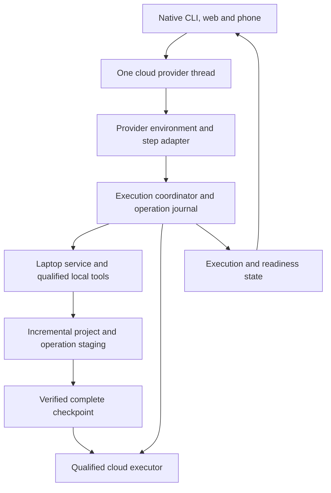

# feat: Seamless hybrid execution with recoverable workspaces

## Recommendation

Keep the conversation in the cloud, attach the actual laptop project before the first task turn, and prepare a complete cloud workspace in the background. Make handoff a coordinated change of execution environment inside the existing conversation. Bind tool results to recoverable file versions so the agent cannot continue on files that contradict what it just observed.

Prefer a provider-aware environment transition over a transparent socket swap. Source research found an existing live environment-update mechanism inside Codex that its public app-server API does not expose. Qualify a narrow integration with that mechanism first. Infinite still needs an execution coordinator, durable tool receipts, a laptop service, and checkpoint storage; a forwarding proxy alone supplies none of these.

This is the implementation plan and remaining research record. Current implementation evidence is summarized below; the document itself is not a validation receipt. The behavioral contract remains [docs/hybrid-execution.md](../hybrid-execution.md); implementation units below explain how to pursue it without duplicating that specification.

## Problem and intended experience

A repository launch currently sends a configured project ID, and the host resolves that project's cloud path. The caller's local directory is not the launch authority. The opt-in hybrid script proves laptop execution in an existing cloud conversation, but requires an initial cloud turn and loses its executor when its wrapper closes.

The intended flow is:

1. Launch inside a project. The first instruction discovery, read, search, patch, and command use that laptop project, including its uncommitted work and nested cwd. The interface appears without waiting for repository transfer.
2. Infinite prepares all selected roots in the background. A small status line distinguishes preparation, readiness, and any operation temporarily preventing handoff.
3. When the laptop disconnects, Infinite settles the current tool boundary, selects an eligible checkpoint, and continues the same authorized task in the cloud. No copied prompt, replacement conversation, or confirmation is needed for a qualified transition.
4. Reopening the laptop attaches to that conversation. Cloud work stays active while a reconciliation preview preserves both cloud changes and offline laptop edits. Returning tools to the laptop is an explicit, safe transition.

An initial baseline that has not arrived, a genuinely uncertain external effect, or an unavailable platform capability remains a specific blocker. The plan must nevertheless demonstrate automatic recovery during a supported operation; merely waiting for every command to finish does not satisfy the intended experience.

## Requirements trace and scope

| Origin requirement | Design mechanism | Units |
| --- | --- | --- |
| R1: authoritative local project | Launch descriptor and laptop admission before task dispatch | 1, 2 |
| R2–R4: complete incremental preparation and consistent checkpoints | Verified immutable generations, separate operation staging, isolated environment recipes | 3, 4 |
| R5: honest readiness on all clients | One versioned execution-state projection | 6 |
| R6: exclusive execution | Workspace ownership, execution generations, enforceable containment | 2, 4, 5 |
| R7: same-conversation handoff | Provider step boundary and explicit environment refresh | 1, 5 |
| R8: determinate outcomes | Durable operation identities, publication barrier, contract-specific recovery | 4, 5 |
| R9: preserve returning laptop edits | Three-way reconciliation in staging and fenced application | 7 |
| R10–R11: scoped access and platform honesty | Authenticated executor admission, root enforcement, qualified capabilities and permissions | 1–5, 7 |
| R12: Codex first, qualify before changing defaults | Versioned provider adapter and real-provider acceptance | 1, 8 |

The first release covers Codex and explicitly qualified OS/toolchain combinations. It does not migrate arbitrary process memory, browser sessions, databases, hardware, or personal configuration. Other providers retain their current behavior. Cloud task execution remains one owner per session, and overlapping selected roots cannot have two authorized task writers. Background dependency preparation has its own isolated scope and cannot perform task effects.

## Repository and protocol grounding

| Existing boundary | What can be reused | What must change |
| --- | --- | --- |
| `packages/host/src/client.ts`, `packages/host/src/server.ts`, `packages/host/src/manager.ts` | Paired launch, project association, detached session worker | Carry and validate local project identity; configured host paths cannot silently replace it |
| `packages/host/src/native-codex.ts` | Persistent app-server, pinned provider thread, native client gateway | This gateway is client-to-app-server, not a tool gateway; add coordinator-owned environment admission and step control |
| `packages/host/src/worker.ts`, `packages/host/src/device-control.ts` | Input authorization, lifetime independent of API, ordered events | Input leases and PTY delivery receipts do not establish tool ownership or outcomes |
| `packages/host/src/vault.ts` | Encrypted journals and atomic sealed records | Add recoverable execution/checkpoint records and explicit crash recovery; worker startup currently refuses a nonempty journal |
| `scripts/hybrid-codex.mjs`, `tests/hybrid-codex.test.ts` | Prototype connection, explicit permission handling, wrapper lifecycle characterization | Production executor must survive interface closure; helper cleanup is not descendant fencing |
| `packages/host/src/types.ts`, `packages/host/src/terminal-stream.ts` | Session and streamed state | Add execution location/readiness separately from conversation-host location and device connectivity |

No `docs/solutions/` collection exists in this checkout. Existing continuity and security documents remain constraints, not evidence of a completed checkpoint subsystem.

Protocol research used the installed experimental schema and official `rust-v0.162.0` source. The public `turn/settings/update` processor supplies no environments, while core has a live selection-update path that validates the named task and applies new selections. This supports investigating a narrow adapter extension; it does not prove a running tool can migrate. [App-server processor](https://github.com/openai/codex/blob/rust-v0.162.0/codex-rs/app-server/src/request_processors/turn_processor.rs), [core step activation](https://github.com/openai/codex/blob/rust-v0.162.0/codex-rs/core/src/session/step_activation.rs).

## Key technical decisions

### 1. Change the provider's environment explicitly

Register laptop and cloud as distinct authenticated execution environments, with a fresh environment ID for each executor generation. Keep their capability descriptions truthful. A stable Infinite coordinator governs their selection and records the transition; it must not impersonate the laptop after routing to a different OS. Codex can reuse resolved metadata for the same environment/workspace pair, so changing an endpoint's metadata response alone is insufficient. [Environment selection reuse](https://github.com/openai/codex/blob/rust-v0.162.0/codex-rs/core/src/environment_selection.rs#L412-L510).

The preferred provider integration adds the missing environment update to the app-server boundary and qualifies an execution-step hold/release around it. Exposing the field is narrow work; holding execution, binding tool identities and confirming adoption are additional provider integration work, not established wrapper capabilities. Pin the qualified provider build, advertise a tested capability, and seek an upstream implementation. Do not treat a matching version string or an experimental field's existence as proof of handoff support.

The transition must refresh cwd, roots, shell/platform information, instructions, tool definitions, permissions and environment-specific services at the next valid step. Persist the selection for subsequent turns and native reconnects as well as the active turn. Any child sessions and tool batches must join the same boundary or remain fenced. An API acknowledgement alone is not proof that every consumer has adopted the new environment.

Already captured model steps and their tool batches must finish, be determinately recovered under the original contract, or be retired before destination dispatch. Do not execute commands produced from laptop context against newly selected cloud settings. The provider's adoption receipt must identify the task incarnation, settled boundary and environment/context revision. Give the transition its own idempotent identity and an authoritative readback operation. After a coordinator restart, dispatch stays held until the provider's actual state agrees with the recovered journal. Provider-process loss is a separate recovery case and may invalidate live captures.

Apply the same admission policy to launch, resume, next-turn settings, active-turn updates, environment registration and other environment mutations exposed by the pinned schema. Include the cloud observer and child-task producers. Keep UI preferences separate from coordinator-owned execution settings. Refuse unqualified child/tool paths before they run; a fence applied after an untracked effect is too late.

The existing step machinery captures environments, refreshes instructions/capabilities and records world-state changes before sampling. The live update contract affects subsequent captures only; future turns need a separate settings update. Require a destination-step adoption receipt. Do not use the internal suspend-and-shutdown path as a pause mechanism: it drops pending input and interactive waiters. [Step capture](https://github.com/openai/codex/blob/rust-v0.162.0/codex-rs/core/src/session/mod.rs#L3720-L3907), [live update contract](https://github.com/openai/codex/blob/rust-v0.162.0/codex-rs/protocol/src/protocol.rs#L452-L481), [shutdown behavior](https://github.com/openai/codex/blob/rust-v0.162.0/codex-rs/core/src/session/turn_suspension.rs#L65-L119).

Bind receipts at the provider tool boundary as well as the executor transport. Native patches can comprise several filesystem RPCs and partially apply; those RPCs do not share a transaction contract. MCP servers also have their own routing. Classify each server and exclude app-server host filesystem/process utilities from the laptop guarantee. [Patch application](https://github.com/openai/codex/blob/rust-v0.162.0/codex-rs/apply-patch/src/lib.rs#L501-L640), [MCP routing](https://github.com/openai/codex/blob/rust-v0.162.0/codex-rs/codex-mcp/src/runtime.rs#L875-L933), [host process API](https://github.com/openai/codex/blob/rust-v0.162.0/codex-rs/app-server-protocol/src/protocol/v2/process.rs#L19-L48).

The stock next-turn environment selector remains useful for intentional idle transitions. It is not an acceptable substitute for automatic interrupted-task continuation. If the narrow extension cannot preserve context and execution semantics, the gate stays closed; do not manufacture a user message to keep the loop going.

### 2. Separate bulk readiness from the small durability path

Use two coordinated data flows:

- **Background project preparation:** populate the complete selected tree and environment. Reuse an authorized Git base and tenant-scoped content by hash; transfer local-only commits and dirty, staged, untracked, deleted and binary state. Batch small objects, resume large transfers, and throttle preparation behind interactive work. Incremental here means reusing unchanged content; efficient changed-chunk transfer for very large binaries is an optimization to justify with measurements.
- **Operation durability:** prioritize the exact inputs, changes and receipt needed to recover each tool operation. The first local tool must not wait for a complete baseline. Persist small recovery records and required content independently, then associate them with a complete generation when that generation is available.

This avoids making a large initial upload the launch barrier. It does not promise offline continuation before the full baseline is ready. A partial Git clone may reduce history transfer, but the included current tree must be materialized and verified. [Git partial-clone documentation](https://git-scm.com/docs/partial-clone).

Start with content-addressed file objects, manifest deltas, resumable transport and a Git seed. Do not add a distributed filesystem or a new synchronization product until the measured bottleneck requires it. Keep caches tenant-scoped to avoid cross-tenant content-existence leaks.

### 3. Commit recoverable evidence before publishing dependent results

Every operation has a stable logical identity, provider call identity, request digest, input generation, execution generation, approval binding and outcome. Physical attempts have separate identities. A retry of persistence is never a retry of execution. Establish the qualified operation's immutable input-view identity before execution even when its bulk content has not finished uploading. Tools whose read/write scope cannot be observed or bounded remain outside that recoverable contract.

For a qualified operation, the order is: record intent; execute under the admitted scope; capture the result and exact recoverable file effects; durably acknowledge them in the cloud; expose the result to provider continuation. A complete project checkpoint may still be preparing. Its absence prevents takeover, but not initial local work.

The boundary covers native file replies, patch outcomes, shell output returned to the model, process polling and tool batches. Waiting only for process exit is insufficient: a polling result can influence the next model step while a child is still writing. Native terminal progress may stream only if it cannot become a model-visible result outside the durability boundary. If the protocol does not expose that distinction, use the conservative result boundary and measure its latency.

If storage fails after a local operation completes, preserve its outcome and content in a bounded encrypted local spool. Show that recovery state is waiting to save; hold result publication and dependent dispatch. Retry saving the existing receipt. Journal failure or spool exhaustion stops new work. A laptop outage during this state cannot use an older checkpoint that contradicts the completed operation.

This journal solves an important race without copying the whole repository after each tool call. It does not, by itself, make arbitrary shell effects transactional.

Join operation evidence to its matching complete baseline using ordered deltas and verified preconditions, including intervening admitted editor changes. Preserve historical observed versions separately from the current workspace state: a later legitimate edit may replace a file previously read by the agent. Cloud eligibility requires a complete causal chain to the selected current generation, not equality with every historical result.

### 4. Recover operations by enforceable contract

| Operation contract | Automatic recovery | Required evidence |
| --- | --- | --- |
| Read/search over a pinned immutable view | Return the stored result, or recompute before publication against the same available view | Input version is available; no hidden write or external effect |
| Gateway-owned file transaction | Complete one logical mutation and materialize its recorded post-image | Approved intent, exact preconditions/post-images, durable commit identity, single publication, fenced old application |
| Isolated finite computation | Discard an unpublished failed attempt and start a cloud attempt | Immutable inputs; writable output confined to a private attempt; no unmediated external effects; only the winning generation can publish |
| Existing cloud process | Reattach to that process and its output | Original process identity and durable output cursor; do not spawn a replacement |
| Arbitrary shell, local service, or external action | Use a determinate receipt or an existing service idempotency/status contract; otherwise stop dependent continuation | Killing a process or losing a socket does not establish its outcome |

Classification comes from enforced tool contracts and sandbox capabilities, never from guessing that a command named `test` or `build` is harmless. A shell-based patch is not automatically a gateway-owned transaction. Arbitrary network access, detached children, writable services and open interactive processes make an attempt ineligible unless specifically handled.

For controlled file transactions, the cloud's durable logical commit is authoritative. Construct post-images from a pinned view, durably retain content and preconditions, commit one logical mutation, then materialize it under the certified laptop write boundary and record that application before publishing local success. This is a special operation contract, not the generic execute-then-record path above. Distinguish committed-but-application-unknown from not-committed. Reconstructing the recorded committed post-image in a new generation is not rerunning an arbitrary write command. A prepared intent alone is not a commit; uncertain preconditions remain unresolved. Multi-file application has a progress journal and prevents agent admission to a partial tree. Concurrent human edits survive as separate versions; a precondition conflict cannot be overwritten to finish materialization.

The input-tree/output-tree pattern is informed by remote execution systems, whose APIs also explicitly allow duplicate physical executions. Therefore Infinite must supply its own publication and side-effect boundary rather than infer exactly-once behavior from a remote job ID. [Remote Execution API](https://github.com/bazelbuild/remote-apis/blob/main/build/bazel/remote/execution/v2/remote_execution.proto).

Keep laptop-first placement. Once the cloud is prepared, offer a nonblocking “Move tools to cloud” action before work that benefits from cloud lifetime. This is a whole-session fenced transition, not silent per-command relocation or another permission prompt on every tool call.

### 5. Fence effects, not just requests

Use a cloud-authoritative monotonically advancing execution generation. Validate it at admission, process continuation, receipt publication and workspace commit. Keep it separate from the phone/native input-control lease. Renewals, revocations and cutover must be durable.

A lease timeout alone cannot stop a paused process from later acting. A shared resource must reject stale authority, or an old attempt must be contained so it cannot affect that resource. This is the relevant lesson from [etcd's fencing example](https://github.com/etcd-io/etcd/blob/main/contrib/lock/README.md); adopting etcd is not required.

For local direct execution, qualify a supervisor and sandbox against descendants, sleep/wake, stale sockets and network partitions. Do not claim that a user-space heartbeat loop can universally stop arbitrary native processes before they resume. Automatic continuation during isolated computations is allowed only when old attempts cannot modify the active project, publish results or reach external services. Late isolated output is quarantined, even if cleanup must wait for laptop reconnection.

Register ownership for canonical overlapping workspace roots above the per-session lease. A second conversation may exist, but cannot become another writer to those roots. Offer an explicitly selected isolated workspace when needed; never silently substitute one for the launch directory.

### 6. Give a checkpoint a precise meaning

A complete checkpoint binds all root manifests, working tree and Git/index distinctions, selected instruction/skill versions, environment recipe, scope rules, operation receipts and execution generation. Keep immutable staged generations separate from the active checkout. Publish the manifest pointer only after all referenced objects and metadata are durably verified. Retain referenced objects while a receipt, active session or reconciliation base needs them.

A file watcher is a scheduling hint. It is not a snapshot proof. The capture adapter must establish an immutable view or a verified coordinated boundary over all included roots. A copy-on-write filesystem snapshot is preferred where it can be used without relocating the user's project or broadening privilege. Capture qualification includes the Git directory/index, linked-worktree metadata and selected external instruction roots. Independent snapshot domains require coordinated write exclusion. A capture that cannot exclude or detect concurrent writes does not become ready just because two scans looked quiet. Unsupported live databases and continuously changing generated data require a declared snapshot/rebuild recipe.

Keep tool-observed versions explicit. Unsynced editor changes that no completed tool observed may fall outside the selected checkpoint under the accepted outage policy. An observed version or completed agent edit cannot silently disappear. When capture cannot certify a newer generation, retain the prior eligible generation and its real age; do not refresh its timestamp.

Use a compatible cloud runtime recipe rather than copying platform-specific dependencies. Preparation executes against staging, scoped caches, constrained network access and separately provisioned credentials. Exclusions apply to Git objects/configuration/hooks and staging as well as visible files. If filtered history cannot preserve required Git behavior, surface that specific capability gap.

### 7. Reconcile in staging and preserve cancellation

On reconnection, verify the laptop identity and fence its old generation before consuming its pending evidence. Build a three-way reconciliation using the last common checkpoint, current cloud generation and current laptop generation. Preserve renames, deletions, binary conflicts and index distinctions. Background synchronization never overwrites the returning tree.

Prepare the proposal while cloud work continues; refresh it when either side changes. Pin both inputs and fence cloud task mutation for final activation. Final application requires a qualified filesystem/editor boundary, a recoverable application journal and preserved displaced versions. A hash check followed by an unconditional overwrite is insufficient. The preservation claim covers certified input versions and versions displaced through this mechanism; it does not promise a recording of every transient save by arbitrary editors. If safe original-tree application cannot be established, leave that tree untouched, keep execution in the cloud and offer the staged reconciled copy explicitly. Never report “returned to laptop” while application is incomplete.

Serialize cutover with accepted steering, cancellation and approvals. Keep accepted input in the same provider conversation once. A stop request cancels automatic continuation even during a switch. An approval is tied to its original operation and environment; stale approval responses cannot authorize a new executor. The existing encrypted draft recovery remains responsible for input whose delivery is uncertain.

## High-level technical design

This illustrates the intended approach and is directional guidance for review, not implementation specification. The implementing agent should treat it as context, not code to reproduce.

The two executor arrows are alternative task owners. They do not authorize concurrent task mutation. The laptop preparation channel remains separate from task dispatch.

For an eligible outage: hold dispatch and the next provider step; reconcile current operation outcomes; establish containment of old attempts; select the checkpoint supported by all published results; advance execution authority; activate the prepared cloud generation; update provider environments/context; acknowledge adoption; release the next step. Record each transition durably so a coordinator restart resumes reconciliation instead of repeating effects.

### Recovery interactions

| Blocker | User-visible evidence | Default behavior and action |
| --- | --- | --- |
| Initial preparation incomplete | Remaining files/bytes, environment work and whether the laptop is needed | Continue preparation automatically where possible; show when laptop reconnection is required |
| Operation evidence waiting to save | Operation, last confirmed stage and storage/laptop availability | Retry persistence automatically; never rerun the operation; allow inspection or stopping the task |
| Required capability unavailable | The specific tool, service or platform needed | Keep the task waiting; identify the needed executor and allow stopping |
| Operation outcome uncertain | Operation identity, last confirmed outcome and available receipts | Offer Inspect outcome, Wait for laptop and Stop task; do not offer a generic execution Retry |

These details appear only when relevant. Ordinary preparation and qualified switching need no confirmation dialog. Inspection opens evidence and does not itself execute recovery work or approve a provider permission.

On laptop return, show a nonblocking Review local changes entry. The preview separates clean changes and unresolved conflicts, with Keep tools in cloud available throughout. Conflicts open both preserved versions for explicit resolution in the staged proposal. Return tools to laptop applies an eligible reviewed proposal and transfers execution; unresolved conflicts disable that action. If either input changes, refresh clean changes and require review of changed conflicts. A canceled or failed application keeps cloud ownership and exposes its recoverable state. The reconciled-workspace fallback names its selected destination and makes clear that the original checkout remains separate.

## Implementation units

### Current implementation status

Default local Codex launch, background complete-root checkpoints, durable executor revision tracking, prepared cloud trees, automatic qualified handoff, visible execution state, and separate recovery downloads are implemented. Real-provider rehearsals cover idle and active-turn outages in the original conversation. The installed client bundle and empty launch have also been exercised. The default is enabled with `--cloud` as the opt-out.

The implementation uses stable file reads, change detection and verified manifests over a capture span. It does not claim an atomic filesystem/database snapshot or arbitrary descendant containment. Epochs fence publication and new RPC dispatch; unresolved operations pause. Cloud tools remain selected on laptop return, and recovery preserves the original tree. Automatic conflict application and return-to-laptop execution remain future work. The stronger containment, toolchain provisioning and application guarantees below remain research follow-ups; they are not advertised by the current `cloudReady` field. The current behavioral boundary is documented in [hybrid execution](../hybrid-execution.md).

- [ ] **Unit 1: Qualify the provider boundary**

**Goal:** Prove explicit environment adoption within one ongoing authorized task. **Requirements:** R1, R7, R11, R12. **Dependencies:** None.

**Files:** Create `packages/host/src/codex-environment.ts`; modify `packages/host/src/native-codex.ts`; extend `tests/native-ui.test.ts` and `tests/fixtures/native-codex.mjs`; add real-provider scenarios in `tests/hybrid-handoff.test.ts`. Any Codex source change belongs to a separately pinned provider patch/upstream contribution, referenced through its official source paths rather than copied into this repository.

**Approach:** Characterize the pinned protocol before changing launch defaults. Separate field exposure from the larger tool/step hold, old-capture settlement and adoption protocol. Before completing the replication subsystem, prove a vertical mediation slice: one provider call retains its logical identity through dispatch, execution, result capture, durable staging and publication, and withholding publication actually stops dependent progress. Extend identity to batches, polls, nested execution and cancellation. Govern every provider request producer, not only native client frames. Inventory file, native patch, search, shell, process polling, MCP, subagent and code-execution paths. Keep unsupported paths visibly ineligible for automatic takeover.

**Test scenarios:** Switch a real provider task between distinguishable fixture executors without a new user prompt; assert the next actual tool and its instructions use the new environment. Change shell/platform metadata and verify context refresh. Reject stale or replaced task incarnations. Capture a tool batch before cutover; no old-context command runs in the new environment. Hold a result and prove dependent progress stops, then publish it once. Lose the transition acknowledgement and reconcile by identity/readback. Reconnect the native UI and submit a phone follow-up; both retain the chosen environment. Deny stale approvals and unadmitted environment IDs from all request producers.

**Verification:** A real-provider trace proves the same thread and authorized continuation with correct environment context. Fixture-only success is insufficient. If the provider boundary fails, keep the existing prototype behavior and record the exact upstream gap.

- [ ] **Unit 2: Bind launch to the laptop service**

**Goal:** First-turn local project parity independent of TUI lifetime. **Requirements:** R1, R6, R10. **Dependencies:** Unit 1 admission contract; takeover remains disabled.

**Files:** Create `packages/host/src/laptop-service.ts` and `packages/host/src/workspace-identity.ts`; modify `packages/host/src/client.ts`, `packages/host/src/server.ts`, `packages/host/src/manager.ts`, `packages/host/src/native-codex.ts` and `packages/host/src/types.ts`; extend `tests/client-cli.test.ts` and `tests/hybrid-codex.test.ts`.

**Approach:** Carry canonical cwd, roots, worktree/branch identity and explicit scope as a launch descriptor. Authenticate the service using paired identity and expiring session/generation capabilities over outbound authenticated transport. Enforce scope at the executor, including links and overlapping roots. Admit the environment before the original prompt can trigger tools. Keep explicit host-project launches intact. The service survives client closure and renews execution authority independently.

**Test scenarios:** Launch from a dirty nested fixture with an unread file and second root; first tools see exactly that scope without baseline preparation. Close or kill the TUI and verify the admitted service remains supervised. Reject path aliases that attempt a second writer, cross-session tokens, symlink escapes and an unavailable local project; never substitute a configured cloud directory. Verify owner/controller/viewer admission boundaries.

**Verification:** Local launch parity is demonstrated from the first turn, with no preliminary cloud turn or repository-transfer barrier. Service lifecycle checks remain distinct from process-fencing qualification.

- [ ] **Unit 3: Prepare complete cloud generations**

**Goal:** Incremental full-scope preparation with truthful readiness. **Requirements:** R2–R5, R10–R11. **Dependencies:** Unit 2 workspace identity.

**Files:** Create `packages/host/src/workspace-checkpoint.ts`, `packages/host/src/workspace-transfer.ts` and `packages/host/src/workspace-environment.ts`; extend `packages/host/src/vault.ts`; add `tests/workspace-checkpoint.test.ts` and extend `tests/vault.test.ts`.

**Approach:** Implement manifest/CAS storage, safe Git seeding, transfer recovery and a capture-adapter contract. Prepare dependency recipes only in isolated staging. Separate completeness, toolchain compatibility and freshness. Maintain a durable publication pointer and object retention references. Do not advertise readiness from watcher events or a directory copy alone.

**Test scenarios:** Reconstruct dirty/staged/untracked/deleted/binary/mode/link fixtures and compare the included tree plus Git/index distinctions. Interrupt uploads and restart storage; the old checkpoint remains intact. Race editor saves, Git index changes and changes across roots; reject an uncertified mixed generation. Exercise watcher overflow and authorized rescan. Reject excluded credentials in objects/hooks/configuration and missing LFS/submodule contents. Block a preparation hook's out-of-scope write or external mutation. A repeated unchanged preparation transfers no source payload already available in the scoped cache.

**Verification:** A verified complete fixture is usable while the laptop is unavailable, including files never read before disconnect. Capture semantics and supported platforms are documented from actual evidence.

- [ ] **Unit 4: Make tool outcomes recoverable**

**Goal:** Preserve the relation between visible results and recoverable state. **Requirements:** R4, R6, R8, R10. **Dependencies:** Units 1–3.

**Files:** Create `packages/host/src/tool-operation.ts` and `packages/host/src/executor-gateway.ts`; integrate `packages/host/src/laptop-service.ts`, `packages/host/src/worker.ts`, `packages/host/src/vault.ts` and `packages/host/src/workspace-checkpoint.ts`; add `tests/tool-operation.test.ts` and extend `tests/hybrid-handoff.test.ts`.

**Approach:** Add intent, attempt, outcome and publication records distinct from input receipts. Implement recovery of these records before enabling result publication: reconstruct authority, checkpoint pointers, pending materialization, provider-result acceptance and retained-object references. A stable provider result identity must support deduplication or acceptance readback; never resend an uncertain result merely because its Infinite record is durable. Gate every qualified provider result path, including polling and partial outputs. Prioritize per-operation evidence over bulk transfer. Implement contract-specific recovery starting with immutable reads and controlled file transactions, followed by sandboxed finite computations. Unknown native process handles stay bound to their original environment; never translate a lost handle into a new command.

**Test scenarios:** Lose the result acknowledgement after a known committed patch; publish the same receipt once without applying the logical mutation again. Crash before and after provider acceptance; recover the existing result identity without duplicating delivery or dropping retained content. Lose storage after local completion; spool the exact result, block dependent work, recover persistence without execution replay. Fail the local journal or fill its bound; new dispatch stops. Lose a read against an available immutable version; recover it automatically. Discard an isolated unpublished attempt and complete a cloud attempt; no losing outputs or external effects escape. An arbitrary command with an unknown effect remains uncertain. Detect an acknowledged result whose required file version is unavailable.

**Verification:** Provider-visible results are tied to durable evidence even when the complete baseline is still preparing. Failure injection demonstrates both successful automatic recovery and honest uncertainty.

- [ ] **Unit 5: Coordinate exclusive cloud takeover**

**Goal:** Automatic handoff at the verified provider boundary. **Requirements:** R5–R8, R10–R12. **Dependencies:** Units 1–4.

**Files:** Create `packages/host/src/execution-coordinator.ts`; integrate `packages/host/src/worker.ts`, `packages/host/src/native-codex.ts`, `packages/host/src/laptop-service.ts`, `packages/host/src/tool-operation.ts` and `packages/host/src/types.ts`; extend `tests/hybrid-handoff.test.ts`, `tests/terminal-worker.test.ts` and `tests/continuity.test.ts`.

**Approach:** Persist the transition and authority generation. Coordinate operation settlement, checkpoint selection, containment and provider adoption before releasing dispatch. Distinguish input ownership from execution ownership. Recover coordinator state after a worker crash without replaying tool effects; API restart continuity alone is insufficient. Preserve stop/approval/input ordering. Laptop return cannot automatically reclaim authority.

**Test scenarios:** Disconnect at idle and during a recoverable tool; continue the same task on an unread cloud file without another prompt. Partition the network while laptop descendants remain alive; verify containment before takeover. Suspend/resume the laptop, send stale renewals and delayed results, and crash each cutover stage; no stale effect publishes and only one owner emerges. Race phone Stop, native Enter and a stale approval response; cancellation prevents continuation and accepted input is not duplicated. Refuse cloud takeover when a completed agent edit is missing even if an older editor checkpoint exists.

**Verification:** Real laptop/cloud topology proves the positive mid-operation flow as well as failure containment. Native process classes without enforceable containment remain explicitly unqualified.

- [ ] **Unit 6: Show one execution state across clients**

**Goal:** Make readiness and automatic transitions understandable without routine prompts. **Requirements:** R5, R7–R9. **Dependencies:** Coordinator projection from Unit 5; rendering may be developed against fixtures earlier.

**Files:** Modify `packages/host/src/types.ts`, `packages/host/src/terminal-stream.ts`, `packages/host/src/client-native.ts`, `apps/web/src/api.ts`, `apps/web/src/main.tsx`, `apps/mobile/src/api/client.ts`, `apps/mobile/src/features/inbox/Inbox.tsx` and `apps/mobile/src/features/session/Brief.tsx`; extend `tests/client-cli.test.ts`, `tests/native-ui.test.ts` and applicable existing web/mobile behavior coverage.

**Approach:** Show “Tools: Laptop · Cloud preparing,” “Tools: Laptop · Cloud ready,” or “Tools: Cloud · Resumed from checkpoint,” with expandable age, backlog, scope and capability details. Distinguish a prepared environment from current-operation eligibility and distinguish API disconnection from laptop unavailability. Surface a specific blocker and relevant recovery action only when needed. Add the intentional move-to-cloud action without automatically changing laptop-first placement.

**Test scenarios:** Observe preparation and takeover simultaneously from CLI/web/phone; states agree. A nontransferable operation revokes eligibility without erasing checkpoint information. Stale clients do not display a local executor as active cloud execution. A pending storage receipt shows recovery progress without falsely reporting task completion. Reconnecting clients show the current generation and preserve unsent drafts.

**Verification:** Inspect the rendered states on all three surfaces. Follow mobile-specific guidance and required checks when implementing those files.

- [ ] **Unit 7: Reconcile and return safely**

**Goal:** Preserve offline laptop edits while making cloud changes usable locally. **Requirements:** R4, R6, R9–R11. **Dependencies:** Units 3–6.

**Files:** Create `packages/host/src/workspace-reconcile.ts`; integrate `packages/host/src/workspace-checkpoint.ts`, `packages/host/src/execution-coordinator.ts`, `packages/host/src/laptop-service.ts` and client execution controls; add `tests/workspace-reconcile.test.ts` and extend `tests/hybrid-handoff.test.ts`.

**Approach:** Reconcile against the retained common base in a new generation. Detect changing inputs, preserve conflict variants and use a recoverable application journal. Qualify the original-tree application mechanism before enabling return there. An explicitly selected reconciled workspace is a visible fallback when write exclusion or safe preservation cannot be established. Cloud execution remains selected until application and provider adoption both succeed.

**Test scenarios:** Merge nonoverlapping changes, preserve same-file and binary conflicts, and handle rename/delete and staged/unstaged differences. Save from an editor during preparation and application; no version disappears and stale proposals cannot commit. Crash halfway through application and recover without a partial tree being admitted for tools. Reject old laptop results; returning does not take ownership until the explicit transition is complete.

**Verification:** Independent file comparisons demonstrate preservation of both sides and correct Git/index state. Successful merge preview alone does not establish successful return.

- [ ] **Unit 8: Qualify and roll out the complete flow**

**Goal:** Enable normal hybrid launch only for combinations that meet the contract. **Requirements:** R1–R12. **Dependencies:** Units 1–7.

**Files:** Extend `tests/hybrid-handoff.test.ts` and fixture data; update `scripts/hybrid-codex.mjs`, `docs/hybrid-execution.md`, `docs/native-continuity.md`, `docs/cli.md`, `docs/security.md`, `docs/architecture.md` and `PRODUCT.md`; wire qualified launch selection in `packages/host/src/client.ts` and `packages/host/src/manager.ts`.

**Approach:** Start opt-in and pin the provider/supervisor/capture profile. Separate local fixture evidence from actual provider/topology evidence. Measure cold launch latency, preparation bytes/time, warm reuse, operation-publication delay, checkpoint lag, takeover delay and the proportion of representative outages that continue automatically. Include many small files, large binaries, local-only commits and large rebuildable caches. Establish release budgets from these measurements; this plan makes no unmeasured timing promise.

Before running qualification, freeze an ordinary-coding workload matrix and the operation classes promised for that profile. It must include actual provider-selected repository inspection/search, native multi-file editing and a dependency-backed check. Inject outages at ordinary tool boundaries and during qualified operations; count blocked attempts and ineligible time in the measurements. Required workflows must pass using their naturally selected tools, without steering the model into special recovery-only fixtures. A successful immutable-read demonstration alone cannot qualify normal launch. Native patch qualification must cover its real multi-RPC behavior through the controlled transaction integration, not assume stock patches are atomic.

**Test scenarios:** Run the origin acceptance gates end to end, including an unseen file after outage, a determinately recoverable interrupted operation, an uncertain external effect, worker restart and return conflicts. Verify unsupported provider versions refuse automatic mode and leave existing sessions recoverable. Disable new hybrid starts during rollback without moving active cloud work back onto stale laptop trees.

**Verification:** Required host/shared checks and applicable mobile lint/typechecks pass, plus a fresh real-provider handoff rehearsal. Publish only sanitized evidence. Change normal launch defaults only after the full positive flow and failure boundaries pass.

## System-wide impact, rollout and remaining research

The coordinator becomes part of the session's durable state. Its schema needs versioning, integrity checks, retention and recovery rules before rollout. Checkpoint garbage collection must preserve active roots, unresolved operations, conflict variants and common reconciliation bases. Storage exhaustion revokes readiness and applies backpressure rather than deleting the last recoverable state.

Native UI clients must retain their existing provider interface while environment ownership is governed centrally. Web and phone are observers/controllers of the same state. Notifications remain tied to observed attention events; automatic executor switching does not imply task completion. No permission request may be answered automatically.

Admission, scope expansion, capability rotation, transfer evidence, error logs and cloud dependency preparation cross trust boundaries. Extend [docs/security.md](../security.md) with the actual enforcement points. Do not describe transport encryption as confidentiality from the executing host administrator.

**Resolved during planning:** preserve one cloud thread; local cwd is authoritative; prepare the entire selected scope incrementally; distinguish operation evidence from baseline readiness; use explicit provider environment transitions; classify recovery by enforced contract; preserve the last verified checkpoint and offline editor tail; reconcile before an explicit laptop return.

**Execution-time gates:** verify the provider integration's step adoption and all tool paths; demonstrate native process containment through sleep/wake; select and prove consistent capture and safe reconciliation adapters for supported filesystems; measure latency/storage/bandwidth on representative repositories. These require implementation and fault injection. Failure of a gate narrows the advertised capability rather than silently weakening the contract.

**Alternatives rejected:** blocking first launch on a full upload; moving provider databases; using a task-file cache as full readiness; treating tunnel loss as fencing; replaying failed-looking commands; and substituting cloud files behind a cached laptop environment identity. A stable protocol gateway remains useful for operation mediation, but it cannot replace explicit environment context or process-state management.
